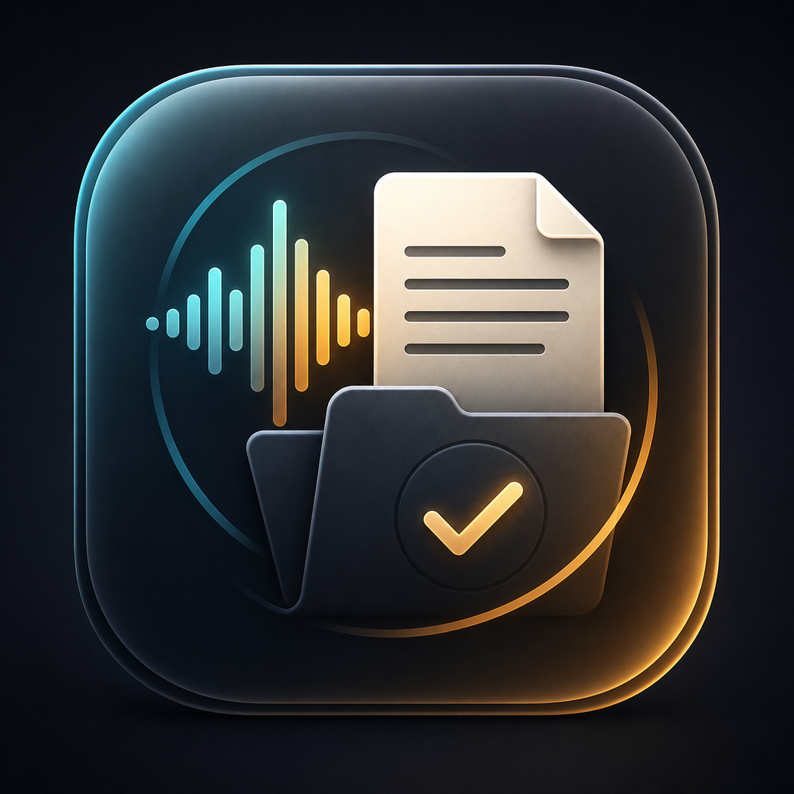
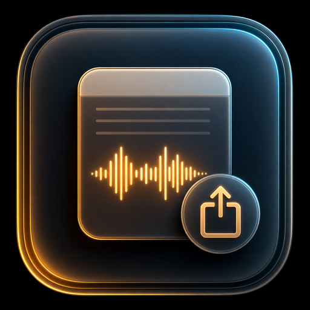
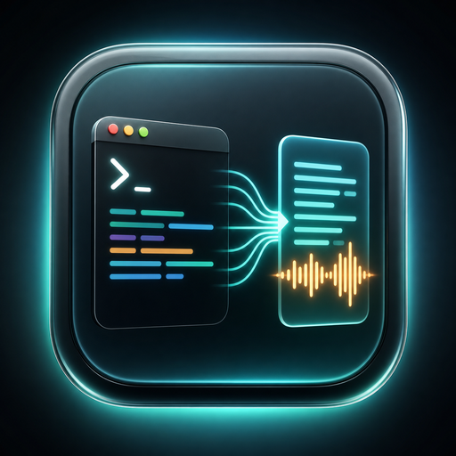
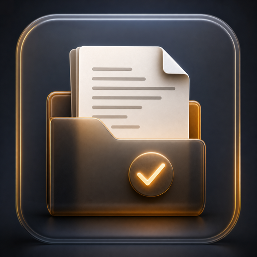
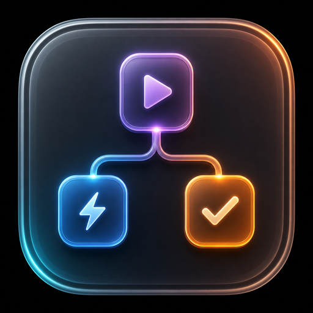
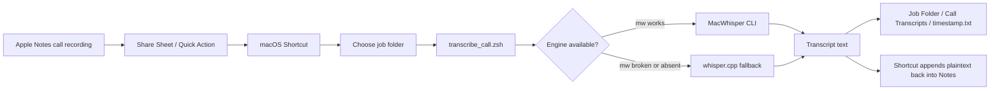
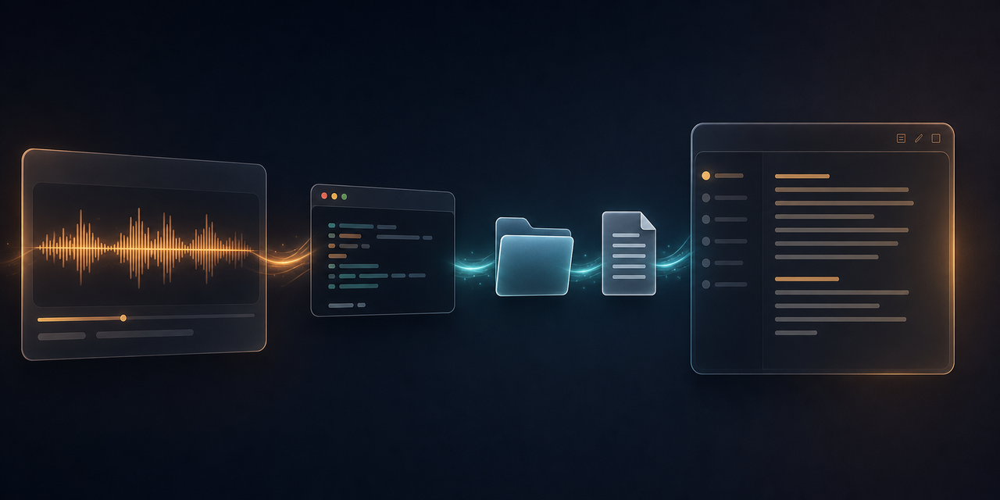

<div align="center">
  
  <h1>MacWhisper Transcription Automation</h1>
  <p><strong>Export an Apple Notes call recording, transcribe it locally, save the transcript to the right job folder, and append the text back into Notes.</strong></p>
  <p>
    <a href="docs/setup.md"></a>
    <a href="docs/shortcut-workflow.md"></a>
    <a href="docs/troubleshooting.md"></a>
  </p>
</div>

<p align="center">
  <picture>
    <source srcset="assets/images/hero-macwhisper-notes-transcription.webp" type="image/webp">
    
  </picture>
</p>

## Why It Exists

Apple Notes makes call recording easy, but the useful follow-up work still takes too many clicks: export the audio, open a transcription app, run a model, save the text, rename the file, find the job folder, then paste the transcript back under the recording.

This repo turns that into a durable macOS workflow:

**Share the recording -> choose a job folder -> receive a filed `.txt` transcript and Notes-ready plaintext.**

The design deliberately avoids scraping the hidden Apple Notes database. Notes stays in charge of notes, Shortcuts handles the handoff, and transcription stays local.

## What It Does

| Step | Result |
| --- | --- |
| Export or share an Apple Notes call recording | Audio arrives from the Share Sheet or Finder Quick Action |
| Pick the job folder | The script creates `<job_folder>/Call Transcripts/` |
| Transcribe locally | Uses MacWhisper CLI when available, with `whisper.cpp` as a fallback |
| Save the transcript | Writes a timestamped `.txt` file with source, timestamp, engine, and script version |
| Return plaintext | Prints the transcript to stdout so Shortcuts can append it back into Notes |

## Feature Set

|  |  |  |  |
| --- | --- | --- | --- |
| **Share Sheet input**<br>Accepts audio from Notes or Finder through a macOS Shortcut. | **Two-engine failover**<br>Prefers `mw transcribe`; falls back to `whisper-cli` when `mw` cannot load. | **Job-folder output**<br>Saves every transcript under `Call Transcripts/` with a safe timestamped filename. | **Notes append path**<br>Returns clean plaintext for Shortcuts to append under the original recording. |

## How It Works



## Requirements

- macOS with Shortcuts.app.
- zsh, included with macOS.
- `afconvert`, included with macOS.
- At least one local transcription engine:
  - **MacWhisper Pro** with the Command-Line Tool installed from MacWhisper > Settings > Advanced > Command-Line Tool.
  - **or** `whisper.cpp` from Homebrew with a ggml model file.

The current script auto-selects the first working engine. If MacWhisper's bundled `mw` binary cannot dyld-load on your macOS, the fallback keeps the workflow usable today.

## Quick Start

```sh
git clone git@github.com:tyhallcsu/macwhisper-transcription-automation.git
cd macwhisper-transcription-automation
./scripts/install.sh

mkdir -p ~/bin
ln -sfn "$(pwd)/scripts/transcribe_call.zsh" ~/bin/transcribe_call.zsh
```

If you need the fallback engine:

```sh
brew install whisper-cpp
mkdir -p ~/.local/share/whisper-cpp/models
curl -L -o ~/.local/share/whisper-cpp/models/ggml-base.en.bin \
  https://huggingface.co/ggerganov/whisper.cpp/resolve/main/ggml-base.en.bin
```

Check the machine:

```sh
./scripts/doctor.sh
```

Then build the Shortcut: **[docs/shortcut-workflow.md](docs/shortcut-workflow.md)**.

## Shortcut Summary

Create a macOS Shortcut named **ESS Transcribe Call Recording**:

1. Enable **Use as Quick Action** and **Use from Share Sheet**.
2. Accept `Audio` and `Files`.
3. Add **Get Folder**, configured as **Ask Each Time**.
4. Add **Run Shell Script**, shell `/bin/zsh`, pass input **as arguments**.
5. Paste:
   ```zsh
   "$HOME/bin/transcribe_call.zsh" "$1" "$JOB_FOLDER"
   ```
6. Replace `$JOB_FOLDER` with the folder magic variable from step 3.
7. Add **Append to Note** and use **Shell Script Result** as the text.

Full walkthrough: **[docs/shortcut-workflow.md](docs/shortcut-workflow.md)**.

## Output Example

Recommended Note title:

```text
JobName - Call with Person - Date
```

Transcript output:

```text
<job_folder>/Call Transcripts/2026-05-08 14.32.05 - Acme-Call-with-Vendor.txt
```

The file contains a compact header:

```text
Call Transcript
Source Audio:   call-recording.m4a
Transcribed:    2026-05-08 14:32:05
Engine:         whisper.cpp (/opt/homebrew/bin/whisper-cli) using ggml-base.en.bin
Script Version: 0.2.0
```

## Privacy Guardrails

This repo is private, but it is built like a project that could safely be public.

- No audio files, transcripts, customer folders, tokens, or local env files should ever be committed.
- `.gitignore` blocks common recording formats, transcript folders, logs, local config, and private/export folders.
- The script runs transcription locally. It does not upload recordings to a third-party transcription service.
- README visuals are synthetic raster images. They do not contain real call recordings, transcripts, names, addresses, or local paths.
- Future screenshots must use fake data only.

Before committing:

```sh
git diff --cached --name-only | grep -Ei '\.(m4a|mp3|wav|aiff|aac|flac|mp4|mov|transcript|log|env)$|Call Transcripts|private|exports|transcripts' && echo "STOP: private file staged" || echo "No obvious private files staged"
```

## Visual Assets

<p align="center">
  <picture>
    <source srcset="assets/images/social-preview.webp" type="image/webp">
    
  </picture>
</p>

This README uses real generated raster assets stored in the repo:

- Hero image: `assets/images/hero-macwhisper-notes-transcription.png`
- App/repo icon: `assets/icons/app-icon.png`
- Feature icons: `assets/icons/*.png`
- Social preview candidate: `assets/images/social-preview.png`
- Prompts and regeneration notes: **[docs/assets.md](docs/assets.md)**

Validate README image references with:

```sh
./scripts/check_readme_assets.sh
```

## Documentation

- **[Setup](docs/setup.md)** - install engines, symlink, smoke test.
- **[Shortcut workflow](docs/shortcut-workflow.md)** - build the Shortcuts.app flow.
- **[Watch folder](docs/watch-folder.md)** - optional drag-and-drop mode.
- **[Troubleshooting](docs/troubleshooting.md)** - common failure modes and fixes.
- **[Visual assets](docs/assets.md)** - asset inventory and regeneration prompts.
- **[Contributing](CONTRIBUTING.md)** - privacy rules and commit style.

## Limitations

- The Shortcut runs on macOS only. iOS Shortcuts cannot execute zsh.
- Appending back into Notes is handled by Shortcuts, not by editing the Apple Notes database.
- MacWhisper CLI requires MacWhisper Pro.
- Some MacWhisper releases ship a GUI that works while the bundled `mw` CLI cannot dyld-load. That is an upstream CLI build issue; `whisper.cpp` fallback is wired to keep this repo useful.

## Roadmap

- [ ] Shortcut flag pass-through for engine/model selection.
- [ ] Multi-language polish around `WHISPER_LANG`.
- [ ] Optional speaker diarization metadata in the transcript header.
- [ ] Engine presets such as `fast`, `balanced`, and `accurate`.
- [ ] Pre-flight codec normalization for unusual source audio.

## License

MIT - see [LICENSE](LICENSE).
